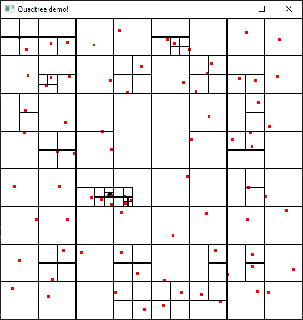

**spatial-rs**



**Features:**
- [x] Quadtree insert and iterator functionality
- [ ] Quadtree delete functionality
- [ ] Quadtree update functionality
- [ ] Octree
- [ ] B-Tree

**Example:**

```rust
use spatial::{quad::*, core::*};

let mut quadtree = Quadtree::<Point2D>::new(
    Bounds::new(-1.0, 1.0, -1.0, 1.0)
);

quadtree.insert(Point2D::new(-0.5, 0.75));
quadtree.insert(Point2D::new(0.0, 0.75));

for point in &quadtree.container {
    println!("{:?}", point);
}
```
    